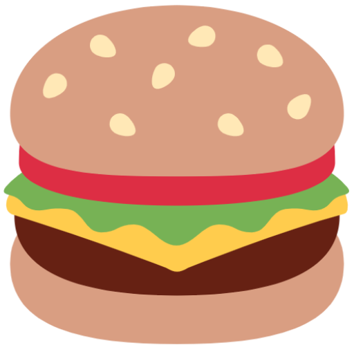

# 

_Burguer_ é um projeto aspirante a ecommerce de hamburgueres, o usuário consegue adicionar produtos no carrinho, excluí-los e aumentar e/ou diminuir a quantidade do produto, além de conseguir pesquisar pelos produtos por nome, categoria.

→ _[Clique aqui para acessar o app](https://vic-burguer.netlify.app/)_

## 💻 Desenvolvimento

Refazer o código e a estilização desse projeto foi muito bom, foi meu primeiro ecommerce em React e confesso que na primeira versão não me agradou muito, faltavam features necessárias e a aplicação não estava do jeito que queria. Agora pude adicionar features que complementaram muito o app e torná-lo totalmente responsivo. Foi utilizado ContextAPI para gerenciar os estaodos globalmente, fiz uso também do localStorage para persistir os produtos no carrinho e decidi estilizar o projeto com styled-components e me arriscar com Chakra UI.

## 📌 Features

- Adicionar os produtos no carrinho
- Remover os produtos do carrinho
- Definir a quantidade de cada produto dentro do carrinho _(feature ainda em teste)_
- Cálculo total dos valores
- Pesquisar os produtos pelo nome, categoria e caracteres

## 🛠️ Ferramentas

#### Obrigada por chegar até aqui!

Feito com ❤️ por [Victoria](https://github.com/victoriavianx)
